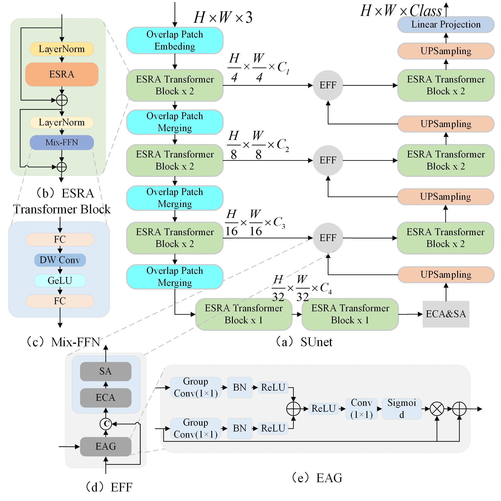
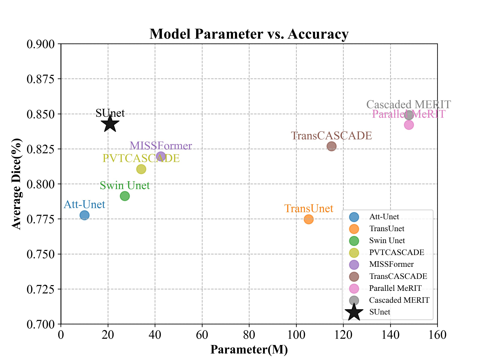
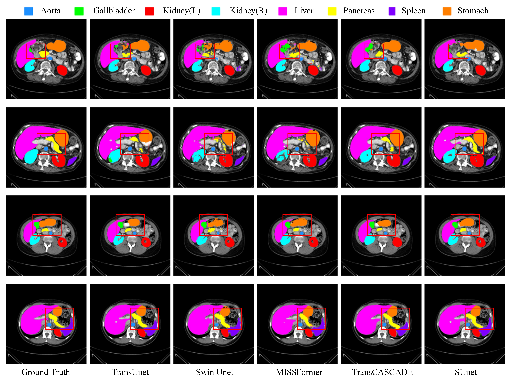

# [SUnet: A multi-organ segmentation network based on multiple attention](https://www.sciencedirect.com/science/article/pii/S0010482523010612)

The official implementation of "SUnet: A multi-organ segmentation network based on multiple attention"
## Architectures
<p align="center">
    
</p>

## Comparison with other models
<p align="center">
    
</p>

## Qualitative Results on Synapse Multi-organ dataset

<p align="center">

</p>

# install:

## Recommended environment:

```python
    Python 3.8 + Pytorch 1.11.0 + torchvision 0.12.0
```
## Create a virtual environment and configure it
```python
     conda create -n 'your environment name' python==3.8
     conda activite 'your environment name'
     conda install pytorch==1.11.0 torchvision==0.12.0 torchaudio==0.11.0 cudatoolkit=11.3 -c pytorch
```
 And please use pip install -r requirements.txt to install the dependencies.

# Data preparation:
## Synapse Multi-organ dataset:
Sign up in the [official Synapse website](https://www.synapse.org/#!Synapse:syn3193805/wiki/89480) and download the dataset. Then split the 'RawData' folder into 'TrainSet' (18 scans) and 'TestSet' (12 scans) following the TransUNet's lists and put in the './data/synapse/Abdomen/RawData/' folder. Finally, preprocess using python ./utils/preprocess_synapse_data.py or download the preprocessed data and save in the './data/synapse/' folder. Note: If you use the preprocessed data from [TransUNet](https://drive.google.com/drive/folders/1ACJEoTp-uqfFJ73qS3eUObQh52nGuzCd), please make necessary changes (i.e., remove the code segment (line# 88-94) to convert groundtruth labels from 14 to 9 classes) in the utils/dataset_synapse.py.

## ACDC dataset:
Download the preprocessed ACDC dataset from Google Drive of [MT-UNet](https://drive.google.com/file/d/13qYHNIWTIBzwyFgScORL2RFd002vrPF2/view) and move into './data/ACDC/' folder.

# Pretrained model
You should download the pretrained pvt_v2_b1 models from [Google Drive](https://drive.google.com/file/d/1aM0KFE3f-qIpP3xfhihlULF0-NNuk1m7/view), and then put it in the './pretrained_pth/pvt/' folder for initialization.

# Training
## Clone the repository and go to the folder
```python
   git clone https://github.com/XSforAI/SUnet.git
   cd SUnet
```
## Train on Synapse
```python
   python train.py
```
## Train on ACDC
```python
   python train_ACDC.py
```
Warnning: Change the parameters when you run the code. For example, root_path

# Acknowledgement

We are very grateful for these excellent works [timm](https://github.com/huggingface/pytorch-image-models),
[MERIT](https://github.com/SLDGroup/MERIT),
[CASCADE](https://github.com/SLDGroup/CASCADE),
[Polyp-PVT](https://github.com/DengPingFan/Polyp-PVT)
and [TransUNet](https://github.com/Beckschen/TransUNet), which have provided the basis for our framework.

# Citations

```python
@article{li2023sunet,
  title={SUnet: A multi-organ segmentation network based on multiple attention},
  author={Li, Xiaosen and Qin, Xiao and Huang, Chengliang and Lu, Yuer and Cheng, Jinyan and Wang, Liansheng and Liu, Ou and Shuai, Jianwei and Yuan, Chang-an},
  journal={Computers in Biology and Medicine},
  volume={167},
  pages={107596},
  year={2023},
  publisher={Elsevier}
}
```